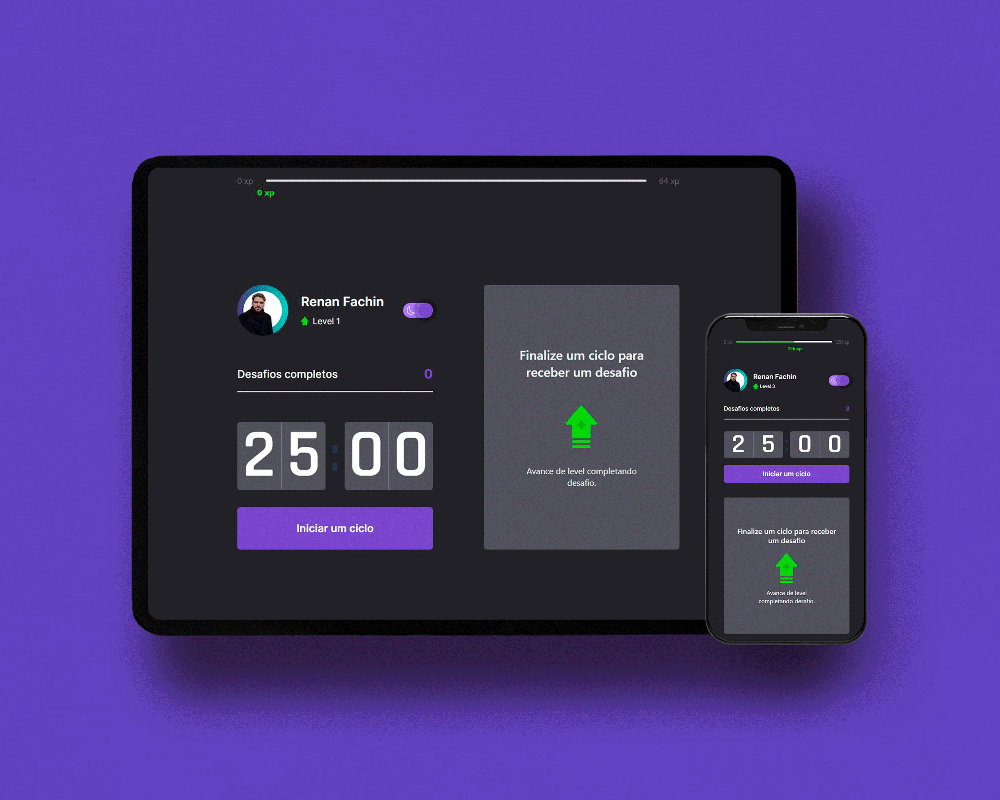
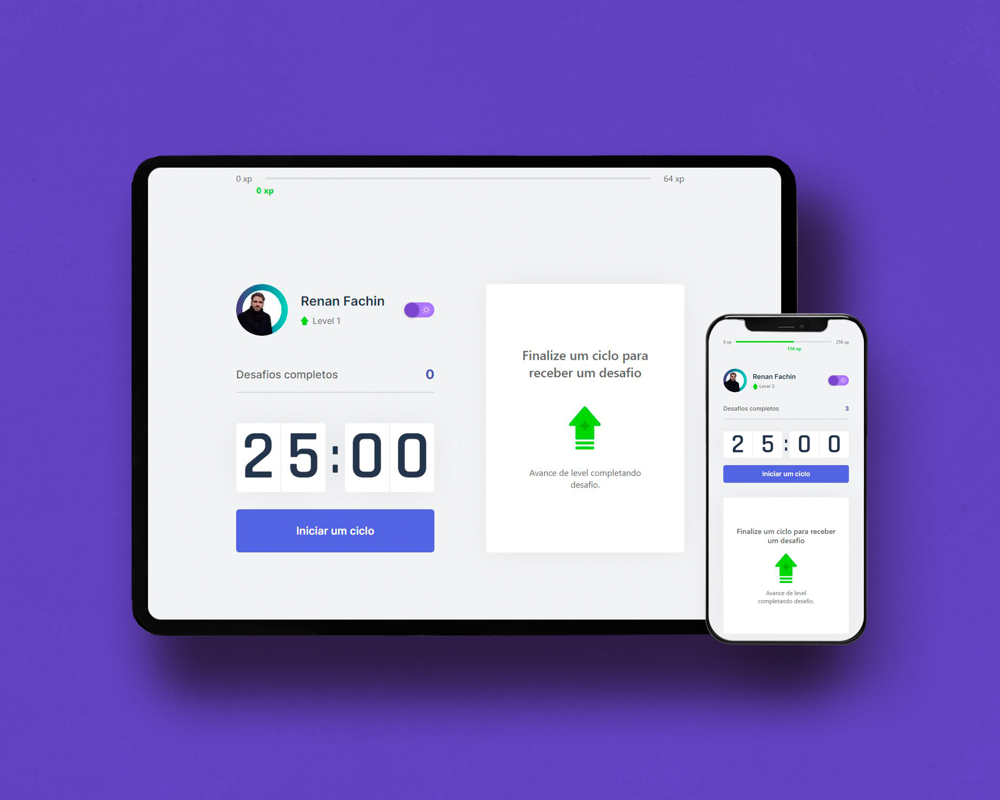
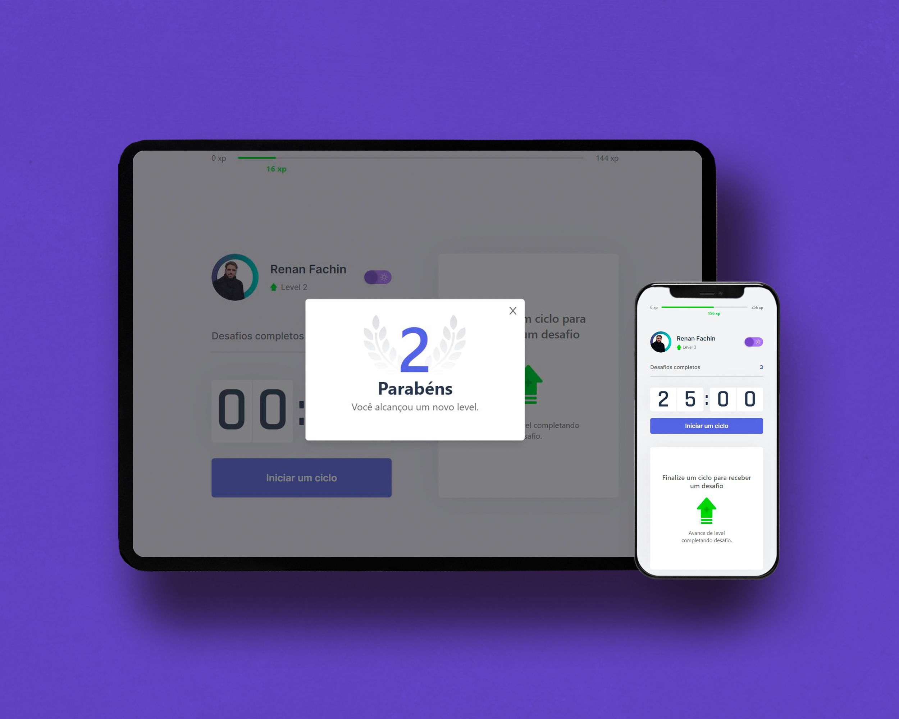
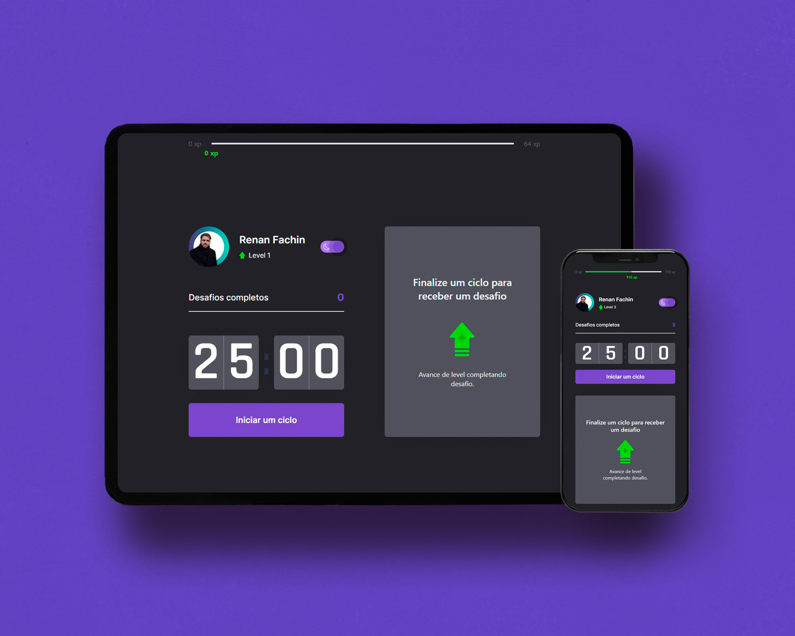

<div align="center" >
  
</div>
<br>

<p align="center">
    
</p>

<p align="center">
    
    
    
</p>

# NLW#04 ReactJS - Move.IT
Aplicação front-end desenvolvida utilizando o NextJS com conceitos de Static Site Generation (SSG) e aplicando conceitos de context API e hooks com a utilização de typescript. <br>
O projeto é uma aplicação que simula um método POMODORO, onde a cada 25 minutos o usuário é alertado de que existe um novo desafio para que ele se mantenha com o corpo e os olhos em movimento.<br>
Para que a aplicação consiga manter os dados foi utilizado a estratégia de salvar os dados de progresso do usuário nos Cookies com o uso da lib js-cookies para auxiliar.<br>

## 🎯 Features adicionais e/ou libs adicionais
- [x] Versão mobile da aplicação
- [x] Dark e Light Mode com uso do reactSwitch e contextAP
- [x] Uso de Tailwindcss para estilização do projeto
- [x] Uso de Radix UI para elaboração de um modal acessibilidade 
- [x] Uso de Lib de icons (React-icons)

## Instalação
Faça o clone do repositório

Instalando as dependências
```bash
npm i
```

Rodando o servidor
```bash
npm run dev
```

## Deploy
- [Move.IT](rs-nlw-move-it.vercel.app)